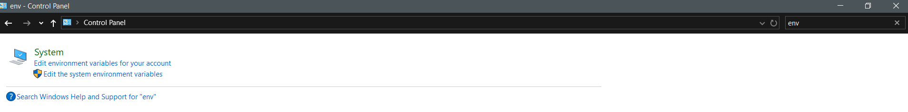
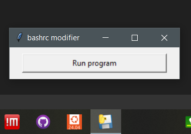

# bashrc_modifiers
Open the wsl's .bashrc file on Windows's portable Sublime Text with 1 click

# Why use this app?
This app allows the user to open the .bashrc file safely without having to manualy navigate from the windows file explorer to open linux files, avoiding this way accidental moving, deletion and accidentally opening the file with notepad, which would compromise it's format.

## Installation
- Install [wsl2](https://github.com/BioGUIwslLab/WSL-Installation)
- Download the file from the `bin` folder
- You can pin this app to the taskbar or start menus
- Download the [portable Sublime Text](https://www.sublimetext.com/download_thanks?target=win-x64-portable)
- Decompress the folder using [WinRAR](https://www.win-rar.com/fileadmin/winrar-versions/winrar/winrar-x64-711.exe)
- Move the folder anywhere you want to store Sublime Text
- In the search bar type `control panel`
- Open `control panel` and type `env` in the top right search bar

- Click `Edit enviromental variable from your account`
- At the top panel click `New` if you don't have a `Path` enviromental variable else click `Edit`
- Add `Path` in the variable name if it doesn't exist and click `Browse Directory` or `Browse` if you clicked to `Edit` the `Path` variable
- Select the folder you previously decompressed
- Click `OK` till all windows close

## Usage
- Open the app

- Click the button to open and modify .bashrc
- When you finish close the folder and program

If you wanna change the default wsl distribution whose .bashrc to modify open `PowerShell` and type:

```PowerShell
wsl -l -v
```
to list the installed distributions and:

```PowerShell
wsl --setdefault <DistributionName>
```
to change the default distribution

If you want to use something sorter than `source ~/.bashrc` open `wsl` and type:

```bash
echo "alias sb='source ~/.bashrc'" >> ~/.bashrc && source ~/.bashrc
```
